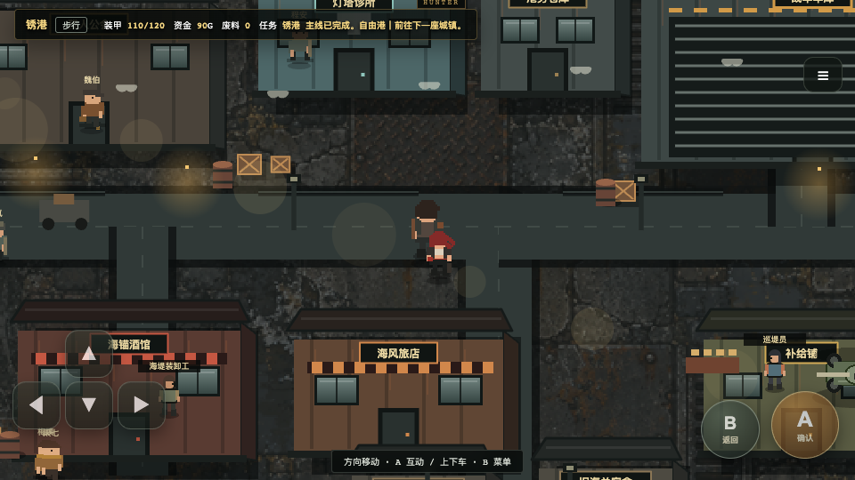
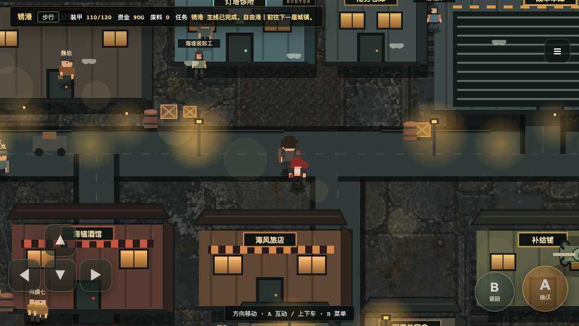
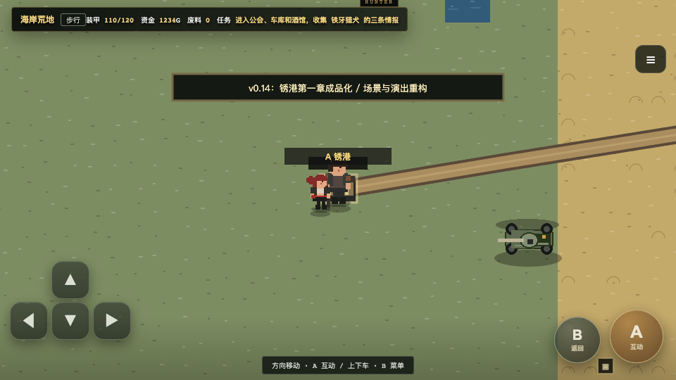
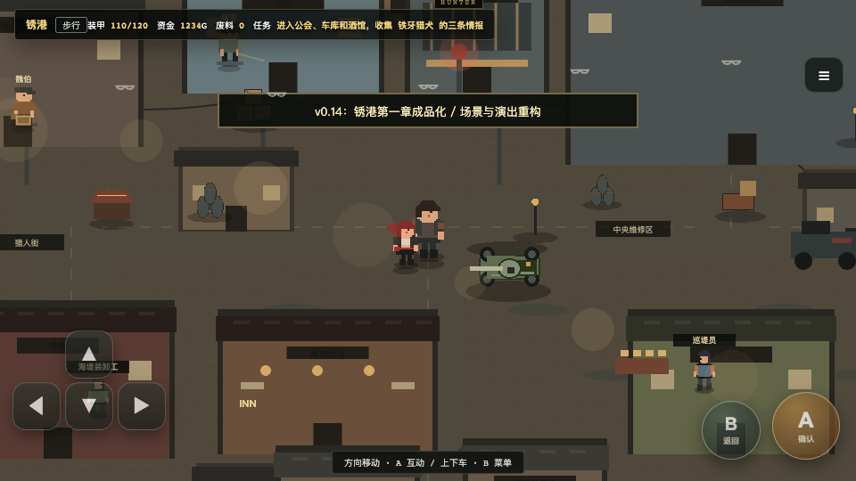
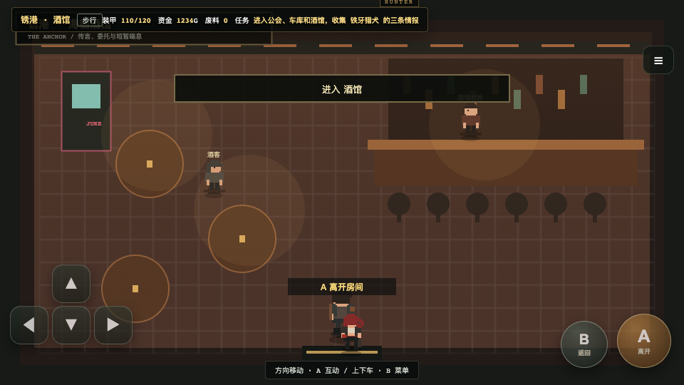
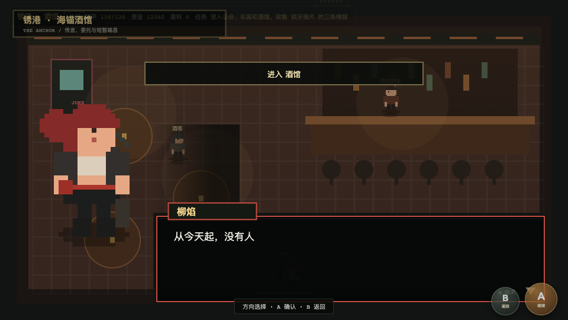
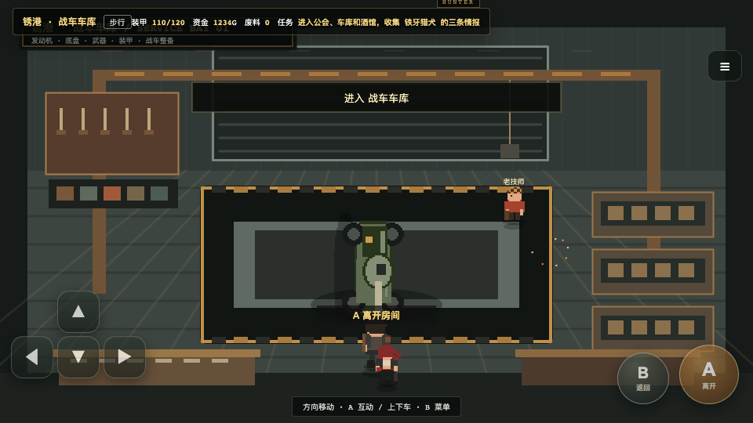
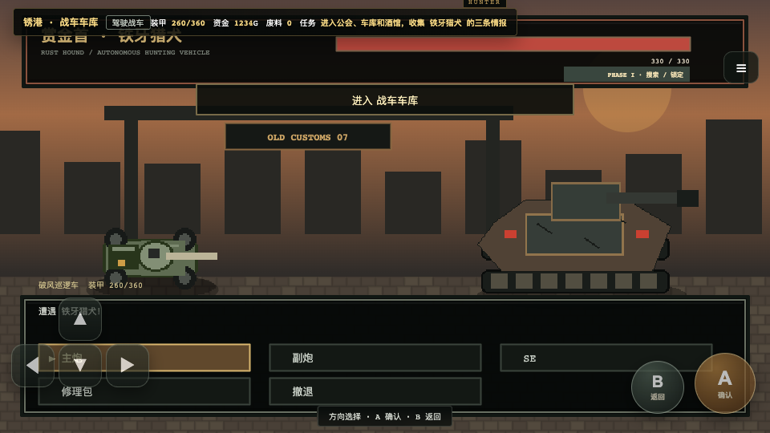

# Wasteland Hunter / 荒原猎手

Canonical engineering repository: `Zeta-hugh/Wastlandhunter`.

This continues the existing game. Read [CODEX_INSTRUCTIONS.md](docs/CODEX_INSTRUCTIONS.md), then the remaining handoff documents before changing it. The next product milestone is the polished Rustport vertical slice: protagonist, Liu Yan, first tank, and Iron Hound.

## Production asset pipeline

The repository now follows [the production asset contract](docs/WastelandHunter_Codex_Production_Asset_Contract_CN.md). Formal source art lives under `assets/source_master/`, runtime PNGs under `assets/runtime/`, metadata under `data/`, Tiled maps under `maps/`, and generated checks under `qa/`. `data/asset_manifest.json` is the unique runtime asset index.

The first compliant import is `ground_dirt_oily_01`: Rustport loads this QA-passed 32×32 tile through `AssetRegistry`. All missing road, building, character, portrait, Rust Runner, weapon and UI art is recorded as `NEEDS_ART`; legacy atlases remain a compatibility layer and never enter `release/assets/`.

```sh
python3 scripts/assets/validate_manifest.py
python3 scripts/assets/validate_assets.py
python3 scripts/assets/validate_maps.py
python3 scripts/assets/validate_vehicle_mounts.py
python3 scripts/assets/build_release_manifest.py
```

The vehicle validator currently returns `NEEDS_ART` until the required independent chassis, tracks, turret and cannon files exist. See [ASSET_INDEX.md](docs/ASSET_INDEX.md) for the current counts and import boundary.

## Rustport visual slice — work in progress / 锈港视觉切片开发中

The first post-baseline visual pass replaces the flat town surface with a production ground asset and gives Rustport a dedicated renderer for its seawall, roads, service buildings, drainage, cables, cargo, lamps, smoke and foreground depth. Gameplay geometry, entrances, NPC schedules, quests and saves remain unchanged.

| Day / 白天 | Dusk / 夜间灯光 |
| --- | --- |
|  |  |

This pass improves the street layer only. Character animation, the first tank, Iron Hound, interiors and UI still require their planned production passes. See [VISUAL_VERTICAL_SLICE.md](docs/VISUAL_VERTICAL_SLICE.md) for the implementation record and acceptance boundary.

## Canon 0.23 runtime baseline / 实机基线

These are screenshots from the migrated game running in Google Chrome at 960 × 540. They document the preserved Canon 0.23 prototype before the planned visual vertical-slice upgrade. The review scenes were opened through QA scene setup, so this gallery demonstrates real rendering rather than a recorded end-to-end playthrough.

| World / 大世界 | Rustport / 锈港街区 |
| --- | --- |
|  |  |

| Tavern / 酒馆 | Liu Yan dialogue / 柳焰对话 |
| --- | --- |
|  |  |

| First tank garage / 第一辆战车车库 | Iron Hound battle / 铁牙猎犬赏金战 |
| --- | --- |
|  |  |

These images are the visual starting point, not milestone acceptance. The governing visual assessment remains [ART_DIRECTION_CN.md](docs/ART_DIRECTION_CN.md), and the target scenes are defined in [ROADMAP_CN.md](docs/ROADMAP_CN.md).

## Run locally

Requires Node.js 22 or newer. The build and development server have no external dependencies.

```sh
npm run dev
```

Open http://127.0.0.1:5173. After source edits, run `npm run build` and refresh. The development server has no hot reload. `dist/` is the standalone static build output.

```sh
npm test
npm install
npm run test:browser
npm run test:route
```

## Independent Web / Android runtime

The new runtime is under `game/app/` and is shared by the Web/PWA entry and Capacitor Android shell. It is built separately so the legacy compatibility entry remains available while the Rustport slice is migrated:

```sh
npm run build:next
npm run test:next
npm run android:sync
```

Android Studio can open the generated `android/` project. The next runtime is currently an infrastructure slice; production character, vehicle and Iron Hound assets are migrated into it in later vertical-slice passes.

Available `QA_PASS` assets are loaded by the independent runtime through `game/app/core/assets.js`; incomplete records remain blocked by the production asset contract.

Browser checks use Playwright and installed Google Chrome with a temporary browser profile. They generate QA captures in ignored `artifacts/` directories and check startup, movement, persistence, image loading and one combat action. Curated milestone and baseline screenshots are tracked separately in `docs/screenshots/`. No player browser profile is accessed.

## Source layout

- `docs/`: original handoff documents plus the engineering migration record.
- `docs/screenshots/`: tracked, curated runtime baseline images displayed above.
- `legacy/`: byte-identical Canon 0.23 monolithic prototype; do not overwrite.
- `game/data/`: character definitions, towns, vehicles and parts.
- `game/story/`: chapter data and Canon world text.
- `game/systems/`: extracted base parts, tank statistics and persistence functions.
- `game/maps/`: focused map-rendering passes; Rustport has the first dedicated visual layer.
- `game/core/`: initialization, base state, portraits and the remaining prototype runtime.
- `game/sources.json`: explicit source assembly order.
- `assets/legacy/`: 16 original embedded images, extracted unchanged with hashes.
- `assets/ui/`: existing stylesheet.

This is an extraction baseline with one confirmed legacy renderer crash fixed (missing inn/house/warehouse palette entries). The build assembles one classic script to preserve function hoisting and historical overrides. It is not yet an ES-module architecture or a completed visual milestone. See [ENGINEERING_MIGRATION.md](docs/ENGINEERING_MIGRATION.md) for boundaries and next steps.
# Wasteland Hunter

## Automatic GitHub backup

On macOS, install the five-hour automatic commit-and-push job with:

```bash
./scripts/install-git-sync-launchd.sh
```

The job adds all local changes, skips empty syncs, creates a timestamped commit,
and pushes the current branch to `origin`. It writes its log to
`.git/auto-sync.log`. GitHub authentication must already be available through
the configured credential helper or SSH agent.
